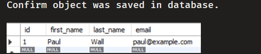

# Basic-Spring-MVC
Spring MVC Demo based on Maven Web application archetype. <br>
Here we connect to a mySQL schema using Hibernate.

We now added a hibernate config file instead of the previous TestJdbc java class. 
### hibernate.cfg.xml

```
<!DOCTYPE hibernate-configuration PUBLIC
        "-//Hibernate/Hibernate Configuration DTD 3.0//EN"
        "http://www.hibernate.org/dtd/hibernate-configuration-3.0.dtd">

<hibernate-configuration>

    <session-factory>

        <!-- JDBC Database connection settings -->
        <property name="connection.driver_class">com.mysql.cj.jdbc.Driver</property>
        <property name="connection.url">jdbc:mysql://localhost:3306/hb_student_tracker?useSSL=false&amp;serverTimezone=UTC</property>
        <property name="connection.username">hbstudent</property>
        <property name="connection.password">hbstudent</property>

        <!-- JDBC connection pool settings ... using built-in test pool -->
        <property name="connection.pool_size">1</property>

        <!-- Select our SQL dialect -->
        <property name="dialect">org.hibernate.dialect.MySQLDialect</property>

        <!-- Echo the SQL to stdout -->
        <property name="show_sql">true</property>

		<!-- Set the current session context -->
		<property name="current_session_context_class">thread</property>
 
    </session-factory>

</hibernate-configuration>
```

### CreateStudentDemo.java

We then create a Session Factory object configured with the hibernate file. 
We create a session and a sample Student object and save it to the database. 
```
package com.example.hibernate.demo;

import com.example.hibernate.demo.entity.Student;
import org.hibernate.Session;
import org.hibernate.SessionFactory;
import org.hibernate.cfg.Configuration;

public class CreateStudentDemo {
    public static void main(String[] args) {

        // create session factory

        SessionFactory factory = new Configuration()
                .configure("/hibernate.cfg.xml").
                addAnnotatedClass(Student.class).
                buildSessionFactory();

        // create session
        Session session = factory.getCurrentSession();

        try {
            // use the session object to save Java object
            // create student object
            System.out.println("Creating object");
            Student student = new Student("Paul", "Wall", "paul@example.com");
            // start a transaction
            session.beginTransaction();
            // save the student object
            session.save(student);
            // commit transaction
            session.getTransaction().commit();
        } finally {
            factory.close();
        }

    }
}

```

